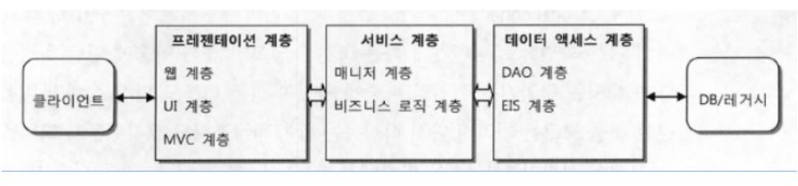
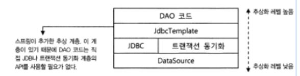
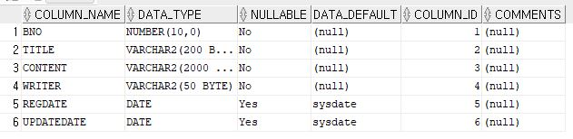

# Part3 정리

## 스프링 MVC 프로젝트의 기본 구성

앞으로 Controller, Service, Repository 등 패키지를 나누어 코딩을 할 것인대 왜 나누는 지에 대해 이해가 부족한 것 같아서 구글링을 통해 조사해보았다.

### 계층형 아키텍처

웹 어플리케이션은 성격이 다른 것들을 다른 아키텍처 레벨에서 처리해줘 유지보수를 편리하게 해준다.

만약, 분리하지 않고 JSP처럼 HTML, JDBC 코드등이 함께 존재한다면, 유지보수는 거의 불가능해진다.

이를 계층형 아키텍처라고 부르고, Java 즉 Spring 프레임워크에서는 주로 3-Tier 어플리케이션 아키텍처를 사용한다.

### Web Project의 3-Tier(티어) 기본 구성

브라우저에서 전송한 데이터를 스프링 MVC는 아래와 같은 3-tier 방식을 거쳐 처리하게 된다.



1. 화면 계층(Presentation Tier)

    화면에 보여주는 기술을 사용하는 영역으로 주로 Servlet/JSP 나 스프링MVC가 담당하는 영역

    클라이언트의 종류와 상관없이 HTTP 프로토콜을 사용한다.

2. 서비스,비지니스(Business Tier)

    순수한 비즈니스 로직을 담고 있는 영역

    고객이 원하는 요구 사항을 반영하는 계층으로 고객의 요구 사항과 정확히 일치해야한다.

    주로 'xxxService'와 같은 이름으로 구성하고, 메서드의 이름 역시 고객들이 사용하는 용어를 그대로 사용하는 것이 좋다.

    이상적인 서비스 코드는 DB와 연결되는 데이터 엑세스 계층이 바뀌거나 클라이언트와 연결되는 프레젠테이션 계층이 모두 바뀌어도 그대로 유지 될 수 있어야 한다.

3. 영속계층, 데이터 엑세스 계층(Persistence Tier)

    데이터를 어떤 방식으로 보관하고, 사용하는가에 대한 설계가 들어가는 계층

    일반적인 경우에는 데이터베이스를 많이 이용하지만, 경우에 따라선 네트워크 호출이나 원격 호출 등의 기술이 접목될 수 있다.

    Spring에서는 아래 그림처럼 같은 데이터 엑세스 계층이지만 역할에 맞게 수직적으로 나눌 수 있다.

    

---

## Part 3 각 영역의 Naming 명명 규칙

- xxxController   
    : 스프링 MVC에서 동작하는 Controller 클래스를 설계할 때 사용
- xxxService, Servicelmpl  
    : 비지니스 영역의 인터페이스는 Service, 인터페이스를 구현한 클래스는 Servicelmpl 사용
- xxxDao, xxxRepository  
    : 데이터 엑세스 영역을 DAO(Data-Access-Object)나 Repository라는 이름으로 명명, 이 책에서는 별도의 DAO를 구성하는 대신 MyBatis의 Mapper 인터페이스 활용
- VO,DTO  
    : VO와 DTO는 일반적으로 유사한 의미로 데이터를 담고 있는 객체를 의미한다는 공통점이 있다. 다만, VO는 주로 Read Only의 목적이 강하고, 데이터 자체도 Immutable(불변)하게 설계하는 것이 정석이다. DTO는 주로 데이터 수집의 용도가 더 강하다.

    ex) 웹 화면에서 로그인하는 정보를 DTO로 처리

---

## 영속 계층의 작업 순서

영속 계층의 작업은 항상 다음과 같은 순서로 진행한다.

0. JDBC 연결 테스트(SQL Developer의 연결로 처리 완료)
1. 테이블의 칼럼 구조를 반영하는 VO(Value Object) 클래스의 생성
2. Mybatis의 Mapper 인터페이스의 작성/XML 처리
3. 작성한 Mapper 인터페이스의 테스트

### 1. VO 클래스의 생성

VO 클래스 생성은 테이블 설계를 기준으로 작성하면 된다.  
현재 tbl_board의 구성은 아래와 같다.



이 구성표를 가지고 BoardVO 클래스를 만들어 준다.

```
org.zerock.domain package/BoardVO

@Data
public class BoardVO {
	private Long bno;
	private String title;
	private String content;
	private String writer;
	private Date regdate;
	private Date updateDate;
}
```

### 2. Mybatis의 Mapper 인터페이스와 Mapper XML

PART1에서 처럼 MyBatis는 SQL을 처리하는데 어노테이션이나 XML을 이용할 수 있다. 주로 간단한 SQL이라면 어노테이션을, 복잡하고 상황에 따라 다른 SQL문이 처리되는 경우라면 XML을 사용한다.

Mybatis를 이용하려면 PART1에서 처럼 Mapper 인터페이스를 읽을 수 있도록 스캔할 'base-package'를 'root-context.xml'에 등록해주어야 한다.

```
root-context.xml

<mybatis-spring:scan base-package="org.zerock.mapper"/>
```

**Mapper 인터페이스 방법**

Mapper 인터페이스를 작성할 때에는 select와 insert 작업을 우선해서 작성한다. org.zerock.mapper 패키지를 작성하고 BoardMapper 인터페이스를 작성한다.

```
org.zerock.mapper/BoardMapper
어노테이션 방법

public interface BoardMapper {
	@Select("select * from tbl_board where bno > 0")
	public List<BoardVO> getList();
}
```

Mapper 인터페이스에선 앞서 작성된 VO 클래스를 이용해 필요한 SQL을 어노테이션의 속성 값으로 처리할 수 있다. **이 방법으로 SQL을 작성할 때는 ';'이 없도록 작성해야 한다.**

**Mapper XML 방법**

'src/main/resources'에 'org/zerock/mapper'단계의 폴더를 생성하고 'BoardMapper.xml' 파일을 작성한다.(폴더를 한 번에 생서하지 말고 하나씩 생성해야 한다.) 파일의 폴더 구조나 이름은 상관없지만 주로 패키지와 클래스 이름과 동일하게 해주어 혼란스러운 상황을 피한다.

```
src/main/resources/org/zerock/mapper/BoardMapper.xml

<?xml version="1.0" encoding="UTF-8" ?>
<!DOCTYPE mapper
	PUBLIC "-//mybatis.org//DTD Mapper 3.0//EN"
	"http://mybatis.org/dtd/mybatis-3-mapper.dtd">
<!-- 
	mapper 연결
	namespace 값 : Mapper 인터페이스와 동일해야 한다.
 -->
<mapper namespace="org.zerock.mapper.BoardMapper">

<!-- 
	select SQL 연결
	id 값 : 메서드의 이름과 동일
	resultType 값 : select 쿼리 결과를 담을 클래스의 객체
	
	CDATA : XML에서 부등호를 사용하기 위해 사용
 -->
<select id="getList" resultType="org.zerock.domain.BoardVO">
<![CDATA[
select * from tbl_board where bno > 0
]]>
</select>
</mapper>
```

XML로 SQL문을 처리하는 경우는 Mapper 인터페이스에 SQL문은 제거해줘야 한다.

```
org.zerock.mapper/BoardMapper

public interface BoardMapper {
	// XML방법을 사용하므로 어노테이션 제거
    // @Select("select * from tbl_board where bno > 0")
	public List<BoardVO> getList();
}
```

### 3. Mapper 인터페이스 테스트

위에서 작성한 Mapper 인터페이스를 테스트 하기위해 'src/test/java'에 'org.zerock.mapper' 패키지를 작성하고 'BoardMapperTests' 클래스를 작성한다.

```
src/test/java/org.zerock.mapper/BoardMapperTests

@RunWith(SpringJUnit4ClassRunner.class)
@ContextConfiguration("file:src/main/webapp/WEB-INF/spring/root-context.xml")
@Log4j
public class BoardMapperTests {
	@Setter(onMethod_ = @Autowired)
	private BoardMapper mapper;
	
	@Test
	public void testGetList() {
		mapper.getList().forEach(board -> log.info(board));
	}
}
```

---

## 영속 영역의 CRUD 구현

영속 영역은 테이블과 VO(DTO) 등 약간의 준비만으로도 비즈니스 로직과 무관하게 CRUD 작업을 자성할 수 있다.

MyBatis는 내부적으로 JDBC의 PreparedStatement를 활용하고 필요한 파라미터를 처리하는 '?'를 '#{속성}'을 이용해서 처리한다.

### **create(insert) 처리**

tbl_board 테이블은 PK 칼럼으로 bno를 이용하고 시퀀스를 이용해서 자동으로 데이터가 추가될 때 번호가 만들어지는 방식을 사용한다.

이처럼 자동으로 PK값이 정해지는 경우에는 다음과 같은 2가지 방식으로 처리할 수 있다.

- insert문만 처리되고 생성된 PK값을 알 필요가 없는 경우
- insert문이 실행되고 생성된 PK값을 알아야 하는 경우

이와 같은 경우를 처리하기 위해 BoardMaper 인터페이스에  
- insert(생성된 PK값을 알 필요가 없는 경우)
- insertSelectKey(생성된 PK값을 알아야 하는 경우)  

메서드를 추가적으로 선언해준다.

```
org.zerock.mapper/BoardMapper

public interface BoardMapper {	
    // 추가되는 내용
    public void insert(BoardVO board);
	public void insertSelectKey(BoardVO board);

    // 어노테이션을 이용하면 아래와 같다.
    
    // @Insert("insert into tbl_board (bno,title,content,writer) values (seq_board.nextval, #{title}, #{content}, #{writer})")
	public void insert(BoardVO board);

    // bno값을 알야해서 select가 먼저 실행되어야 하는데 처리 방법을 모르겠음 
	public void insertSelectKey(BoardVO board);
}
```

BoardMapper.xml에는 다음과 같은 내용이 추가되어야 한다.

```
src/main/resources/org/zerock/mapper/BoardMapper.xml

<?xml version="1.0" encoding="UTF-8" ?>
<!DOCTYPE mapper
	PUBLIC "-//mybatis.org//DTD Mapper 3.0//EN"
	"http://mybatis.org/dtd/mybatis-3-mapper.dtd">
<mapper namespace="org.zerock.mapper.BoardMapper">

<insert id="insert">
insert into tbl_board (bno,title,content,writer) values (seq_board.nextval, #{title}, #{content}, #{writer})
</insert>

<insert id="insertSelectKey">
    <!-- bno 값을 구하는 코드 -->
	<selectKey keyProperty="bno" order="BEFORE" resultType="long">
	select seq_board.nextval from dual
	</selectKey>

insert into tbl_board (bno,title,content,writer) values (#{bno}, #{title}, #{content}, #{writer}) 
</insert>

</mapper>
```

insert()는 단순히 다음 시퀀스 값을 구해서 insert할 때 사용하므로 1번의 SQL 처리만으로 작업이 완료된다.

insertSelectKey()는 @SelectKey라는 MyBatis의 어노테이션을 이용해 PK값을 미리(before) SQL을 통해서 처리해 두고 특정한 이름으로 결과를 보관하는 방식을 이용해 이 처리된 결과로 insert문을 실행하는 방식을 이용한다.
