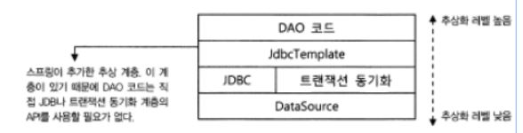

# 스프링 MVC 프로젝트의 기본 구성

앞으로 Controller, Service, Repository 등 패키지를 나누어 코딩을 할 것인대 왜 나누는 지에 대해 이해가 부족한 것 같아서 구글링을 통해 조사해보았다.

## 계층형 아키텍처

웹 어플리케이션은 성격이 다른 것들을 다른 아키텍처 레벨에서 처리해줘 유지보수를 편리하게 해준다.

만약, 분리하지 않고 JSP처럼 HTML, JDBC 코드등이 함께 존재한다면, 유지보수는 거의 불가능해진다.

이를 계층형 아키텍처라고 부르고, Java 즉 Spring 프레임워크에서는 주로 3-Tier 어플리케이션 아키텍처를 사용한다.

## Web Project의 3-Tier(티어) 기본 구성

브라우저에서 전송한 데이터를 스프링 MVC는 아래와 같은 3-tier 방식을 거쳐 처리하게 된다.

1. 화면 계층(Presentation Tier)

    화면에 보여주는 기술을 사용하는 영역으로 주로 Servlet/JSP 나 스프링MVC가 담당하는 영역

    클라이언트의 종류와 상관없이 HTTP 프로토콜을 사용한다.

2. 서비스,비지니스(Business Tier)

    순수한 비즈니스 로직을 담고 있는 영역

    고객이 원하는 요구 사항을 반영하는 계층으로 고객의 요구 사항과 정확히 일치해야한다.

    주로 'xxxService'와 같은 이름으로 구성하고, 메서드의 이름 역시 고객들이 사용하는 용어를 그대로 사용하는 것이 좋다.

    이상적인 서비스 코드는 DB와 연결되는 데이터 엑세스 계층이 바뀌거나 클라이언트와 연결되는 프레젠테이션 계층이 모두 바뀌어도 그대로 유지 될 수 있어야 한다.

3. 영속계층, 데이터 엑세스 계층(Persistence Tier)

    데이터를 어떤 방식으로 보관하고, 사용하는가에 대한 설계가 들어가는 계층

    일반적인 경우에는 데이터베이스를 많이 이용하지만, 경우에 따라선 네트워크 호출이나 원격 호출 등의 기술이 접목될 수 있다.

    Spring에서는 아래 그림처럼 같은 데이터 엑세스 계층이지만 역할에 맞게 수직적으로 나눌 수 있다.

    
