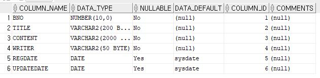

# 영속 계층의 작업 순서

영속 계층의 작업은 항상 다음과 같은 순서로 진행한다.

0. JDBC 연결 테스트(SQL Developer의 연결로 처리 완료)
1. 테이블의 칼럼 구조를 반영하는 VO(Value Object) 클래스의 생성
2. Mybatis의 Mapper 인터페이스의 작성/XML 처리
3. 작성한 Mapper 인터페이스의 테스트

## 1. VO 클래스의 생성

VO 클래스 생성은 테이블 설계를 기준으로 작성하면 된다.  
현재 tbl_board의 구성은 아래와 같다.



이 구성표를 가지고 BoardVO 클래스를 만들어 준다.

```
org.zerock.domain package/BoardVO

@Data
public class BoardVO {
	private Long bno;
	private String title;
	private String content;
	private String writer;
	private Date regdate;
	private Date updateDate;
}
```

## 2. Mybatis의 Mapper 인터페이스와 Mapper XML

PART1에서 처럼 MyBatis는 SQL을 처리하는데 어노테이션이나 XML을 이용할 수 있다. 주로 간단한 SQL이라면 어노테이션을, 복잡하고 상황에 따라 다른 SQL문이 처리되는 경우라면 XML을 사용한다.

Mybatis를 이용하려면 PART1에서 처럼 Mapper 인터페이스를 읽을 수 있도록 스캔할 'base-package'를 'root-context.xml'에 등록해주어야 한다.

```
root-context.xml

<mybatis-spring:scan base-package="org.zerock.mapper"/>
```

**Mapper 인터페이스 방법**

Mapper 인터페이스를 작성할 때에는 select와 insert 작업을 우선해서 작성한다. org.zerock.mapper 패키지를 작성하고 BoardMapper 인터페이스를 작성한다.

```
org.zerock.mapper/BoardMapper
어노테이션 방법

public interface BoardMapper {
	@Select("select * from tbl_board where bno > 0")
	public List<BoardVO> getList();
}
```

Mapper 인터페이스에선 앞서 작성된 VO 클래스를 이용해 필요한 SQL을 어노테이션의 속성 값으로 처리할 수 있다. **이 방법으로 SQL을 작성할 때는 ';'이 없도록 작성해야 한다.**

**Mapper XML 방법**

'src/main/resources'에 'org/zerock/mapper'단계의 폴더를 생성하고 'BoardMapper.xml' 파일을 작성한다.(폴더를 한 번에 생서하지 말고 하나씩 생성해야 한다.) 파일의 폴더 구조나 이름은 상관없지만 주로 패키지와 클래스 이름과 동일하게 해주어 혼란스러운 상황을 피한다.

```
src/main/resources/org/zerock/mapper/BoardMapper.xml

<?xml version="1.0" encoding="UTF-8" ?>
<!DOCTYPE mapper
	PUBLIC "-//mybatis.org//DTD Mapper 3.0//EN"
	"http://mybatis.org/dtd/mybatis-3-mapper.dtd">
<!-- 
	mapper 연결
	namespace 값 : Mapper 인터페이스와 동일해야 한다.
 -->
<mapper namespace="org.zerock.mapper.BoardMapper">

<!-- 
	select SQL 연결
	id 값 : 메서드의 이름과 동일
	resultType 값 : select 쿼리 결과를 담을 클래스의 객체
	
	CDATA : XML에서 부등호를 사용하기 위해 사용
 -->
<select id="getList" resultType="org.zerock.domain.BoardVO">
<![CDATA[
select * from tbl_board where bno > 0
]]>
</select>
</mapper>
```

XML로 SQL문을 처리하는 경우는 Mapper 인터페이스에 SQL문은 제거해줘야 한다.

```
org.zerock.mapper/BoardMapper

public interface BoardMapper {
	// XML방법을 사용하므로 어노테이션 제거
    // @Select("select * from tbl_board where bno > 0")
	public List<BoardVO> getList();
}
```

## 3. Mapper 인터페이스 테스트

위에서 작성한 Mapper 인터페이스를 테스트 하기위해 'src/test/java'에 'org.zerock.mapper' 패키지를 작성하고 'BoardMapperTests' 클래스를 작성한다.

```
src/test/java/org.zerock.mapper/BoardMapperTests

@RunWith(SpringJUnit4ClassRunner.class)
@ContextConfiguration("file:src/main/webapp/WEB-INF/spring/root-context.xml")
@Log4j
public class BoardMapperTests {
	@Setter(onMethod_ = @Autowired)
	private BoardMapper mapper;
	
	@Test
	public void testGetList() {
		mapper.getList().forEach(board -> log.info(board));
	}
}
```