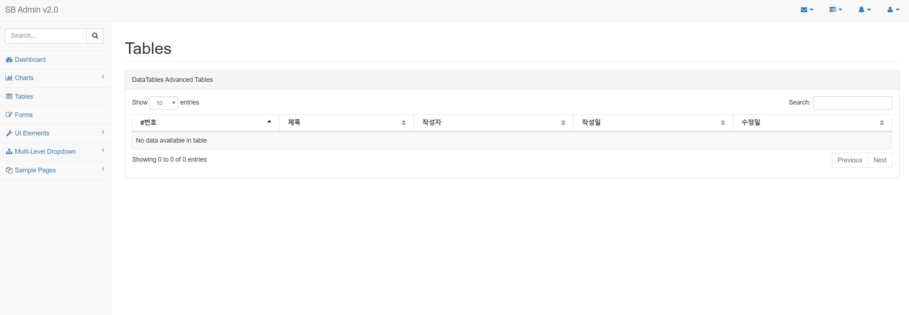
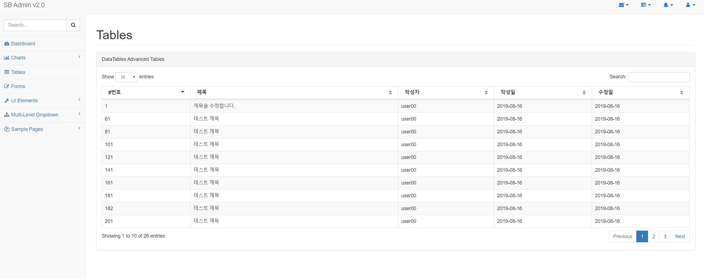
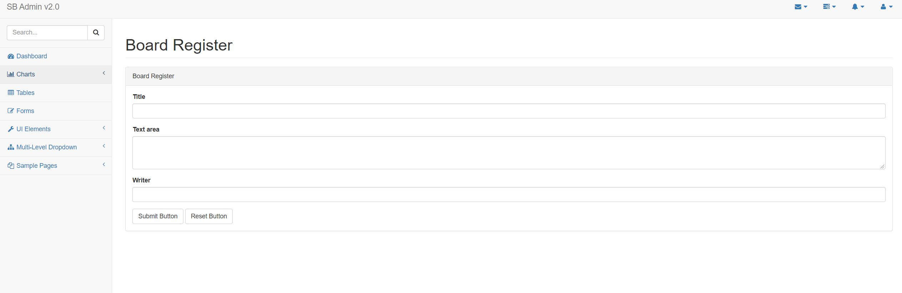
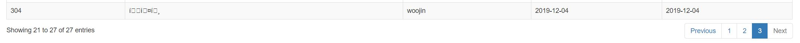
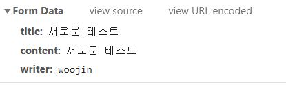
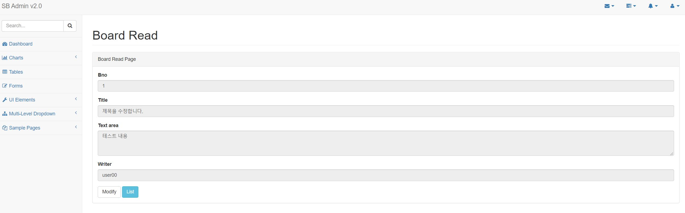
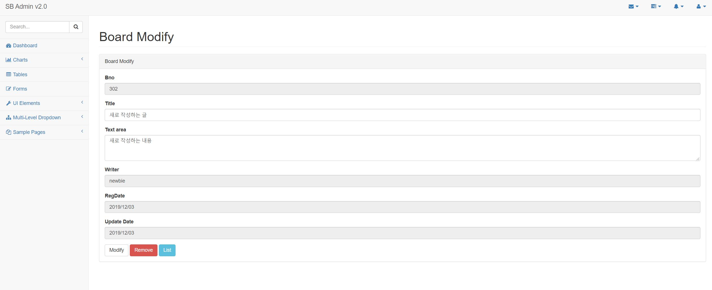

# 화면 처리

## **JSP 경로 설정**

스프링 MVC의 JSP를 처리하는 설정을 servlet-context.xml에 작성한다.

```
<beans:bean class="org.springframework.web.servlet.view.InternalResourceViewResolver">
    <beans:property name="prefix" value="/WEB-INF/views/" />
    <beans:property name="suffix" value=".jsp" />
</beans:bean>
```

Spring MVC에서 화면 설정은 ViewResolver라는 객체를 통해 이루어지는데 위 설정을 보면, '/WEB-INF/views' 폴더를 이용하는 것을 볼 수 있다.
즉, 게시물 리스트의 URL은 '/board/list'이므로 최종 URL은 '/WEB-INF/views/board/list.jsp'가 된다.

## **화면 처리 관련 resources 파일=정적인 파일(css, js 파일) 경로 설정**

부트스트랩과 같은 외부 css등을 사용할 때 경로가 달라 적용이 안되는 경우가 있다.

servlet-context.xml에는 resources와 관련된 경로를 설정할 수 있으니 이를 이용하여 알맞은 경로에 정적파일을 배치해야한다.

```
<!-- Handles HTTP GET requests for /resources/** by efficiently serving up static resources in the ${webappRoot}/resources directory -->
<resources mapping="/resources/**" location="/resources/" />
```

참고로 여기서의 resources는 WAS의 resources이므로 webapp 밑의 resources 폴더이다.

## **게시글 list 화면처리**

아래는 resources 파일 경로 설정과 header, footer로 나눈 list.jsp 이다.

```
<%@ page language="java" contentType="text/html; charset=UTF-8"
    pageEncoding="UTF-8"%>

<!-- JSTL 태그 라이브러리 추가 -->
<%@ taglib uri="http://java.sun.com/jsp/jstl/core" prefix="c" %>
<%@ taglib uri="http://java.sun.com/jsp/jstl/fmt" prefix="fmt" %>
    
<%@include file= "../includes/header.jsp" %>
    
            <div class="row">
                <div class="col-lg-12">
                    <h1 class="page-header">Tables</h1>
                </div>
                <!-- /.col-lg-12 -->
            </div>
            <!-- /.row -->
            <div class="row">
                <div class="col-lg-12">
                    <div class="panel panel-default">
                        <div class="panel-heading">
                            Board Tables
                        </div>
                        <!-- /.panel-heading -->
                        <div class="panel-body">
                            <table width="100%" class="table table-striped table-bordered table-hover" id="dataTables-example">
                                <thead>
                                    <tr>
                                        <th>#번호</th>
                                        <th>제목</th>
                                        <th>작성자</th>
                                        <th>작성일</th>
                                        <th>수정일</th>
                                    </tr>
                                </thead>
                     
                                </table>
                            </div>
                            <!-- /.table-responsive -->
                        </div>
                        <!-- /.panel-body -->
                    </div>
                    <!-- /.panel -->
                </div>
                <!-- /.col-lg-6 -->
            </div>
            <!-- /.row -->


<%@include file= "../includes/footer.jsp" %>
```



dlal '/board/list'를 실행했을 때 Controller의 Model을 이용해서 'list'라는 이름으로 게시물 목록을 전달했으므로 list.jsp는 JSTL을 이용해서 출력만 하면 된다.

list.jsp 내에 \<tbody> 태그와 각 \<tr> 태그를 \<thead> 밑에 아래와 같이 작성한다.

```
    <c:forEach items="${list}" var="board">
        <tr>
            <td><c:out value="${board.bno }"/></td>
            <td><c:out value="${board.title }"/></td>
            <td><c:out value="${board.writer }"/></td>
            <td><fmt:formatDate pattern="yyyy-MM-dd" value="${board.regdate}" /></td>
            <td><fmt:formatDate pattern="yyyy-MM-dd" value="${board.updateDate}" /></td>
            
        </tr>
    </c:forEach>
</table>
```

브라우저를 통해 결과를 보면 데이터 베이스에 있는 전체 목록이 출력된다.



## **등록 입력 페이지와 등록 처리**

게시물 등록 작업은 POST 방식으로 처리하지만 화면 입력 창을 보여야 하므로 GET 방식으로 BoardController에 메서드를 추가해준다.

```
@GetMapping("/register")
public void register() {
    
}
```

이 메서드는 입력 페이지를 보여주는 역할만을 하기 때문에 별도의 처리가 필요하지 않다.

그 후에 보여질 register.jsp를 views/board 밑에 생성해준다. register.jsp 역시 header와 footer를 가진다.

```
<%@ page language="java" contentType="text/html; charset=UTF-8"
    pageEncoding="UTF-8"%>
    
<!-- JSTL 태그 라이브러리 추가 -->
<%@ taglib uri="http://java.sun.com/jsp/jstl/core" prefix="c" %>
<%@ taglib uri="http://java.sun.com/jsp/jstl/fmt" prefix="fmt" %>

<%@include file="../includes/header.jsp"%>
    
<div class="row">
  <div class="col-lg-12">
    <h1 class="page-header">Board Register</h1>
  </div>
  <!-- /.col-lg-12 -->
</div>
<!-- /.row -->

<div class="row">
  <div class="col-lg-12">
    <div class="panel panel-default">

      <div class="panel-heading">Board Register</div>
      <!-- /.panel-heading -->
      <div class="panel-body">

        <form role="form" action="/board/register" method="post">
          <div class="form-group">
            <label>Title</label> <input class="form-control" name='title'>
          </div>

          <div class="form-group">
            <label>Text area</label>
            <textarea class="form-control" rows="3" name='content'></textarea>
          </div>

          <div class="form-group">
            <label>Writer</label> <input class="form-control" name='writer'>
          </div>
          <button type="submit" class="btn btn-default">Submit
            Button</button>
          <button type="reset" class="btn btn-default">Reset Button</button>
        </form>

      </div>
      <!--  end panel-body -->

    </div>
    <!--  end panel-body -->
  </div>
  <!-- end panel -->
</div>
<!-- /.row -->

<%@include file="../includes/footer.jsp"%>
```

register.jsp는 \<form> 태그를 이용해서 필요한 데이터를 전송한다. \<input>이나 \<textarea> 태그의 name 속성은 각 BoardVO 클래스 변수와 일치시켜 준다.



register 화면에 글을 입력하고 제출 버튼을 누르면 redirect되어 게시글 등록 후 다시 게시글 list 페이지로 이동하는 것을 볼 수 있다. **이를 해주지 않으면 사용자가 '새로고침'을 이용해 동일한 내용을 계속 서버에 등록할 수 있기 때문에 문제가 발생한다.(흔히 도배)**



재대로 등록되지만 게시글의 한글이 깨진 것을 볼 수 있다. 이 경우에는 1) 브라우저에서 한글이 깨져서 전송되는지, 2) 스프링 MVC쪽에서 한글을 처리하지 못하는 지를 확인해야한다.

**1)의 브라우저에서 전송되는 데이터는** 개발자 도구를 이용해서 확인할 수 있다. 개발자 도구에서 'Network' 탭을 열어둔 상태에서 데이터를 보내면 해당 내용을 볼 수 있다.



**2)의 Spring MVC 데이터는** Controller와 ServiceImpl을 개발할 때 Lombok의 log를 이용해서 기록해 두었으므로 이를 확인하면 된다.

2)의 경우에는 web.xml에 아래와 같이 필터를 추가해줘야 한다.

```
<filter>
    <filter-name>encoding</filter-name>
    <filter-class>org.springframework.web.filter.CharacterEncodingFilter</filter-class>
    <init-param>
        <param-name>encoding</param-name>
        <param-value>UTF-8</param-value>
    </init-param>
</filter>

<filter-mapping>
    <filter-name>encoding</filter-name>
    <servlet-name>appServlet</servlet-name>
</filter-mapping>
```

전부 다 되었다면, 마지막으로 게시글 등록 버튼을 목록 페이지에 추가해주어야 한다.
list.jsp에 버튼을 추가하고 jQuery를 이용해 해당 버튼을 클릭했을 때의 동작을 정의한다.

```
// HTML

<div class="panel-heading">
    Board Tables
    <button id='regBtn' type="button" class="btn btn-xs pull-right">Register New Board</button>
</div>


// JQuery

<script>
$(document).ready(
	function(){
		$("#regBtn").on("click", function(){
			self.location="/board/register";
		});
	});
</script>
```

위와 같이 작성하였다면 화면에서 Register New Board 버튼을 클릭하면 register 페이지로 이동할 수 있다.

## **조회 페이지와 이동**

이제 만들어 볼 페이지는 목록 페이지에서 링크를 통해 GET 방식으로 특정한 번호의 게시물을 조회할 수 있는 기능을 만들어 볼 것이다. 게시물 조회는 BoardController에서 get()메서드를 이용한다.

```
<%@ page language="java" contentType="text/html; charset=UTF-8"
    pageEncoding="UTF-8"%>
    
<!-- JSTL 태그 라이브러리 추가 -->
<%@ taglib uri="http://java.sun.com/jsp/jstl/core" prefix="c" %>
<%@ taglib uri="http://java.sun.com/jsp/jstl/fmt" prefix="fmt" %>

<%@include file="../includes/header.jsp"%>
    
<div class="row">
  <div class="col-lg-12">
    <h1 class="page-header">Board Read</h1>
  </div>
  <!-- /.col-lg-12 -->
</div>
<!-- /.row -->

<div class="row">
  <div class="col-lg-12">
    <div class="panel panel-default">

      <div class="panel-heading">Board Read Page</div>
      <!-- /.panel-heading -->
      <div class="panel-body">

        <div class="form-group">
          <label>Bno</label> <input class="form-control" name='bno'
            value='<c:out value="${board.bno }"/>' readonly="readonly">
        </div>

        <div class="form-group">
          <label>Title</label> <input class="form-control" name='title'
            value='<c:out value="${board.title }"/>' readonly="readonly">
        </div>

        <div class="form-group">
          <label>Text area</label>
          <textarea class="form-control" rows="3" name='content'
            readonly="readonly"><c:out value="${board.content}" /></textarea>
        </div>

        <div class="form-group">
          <label>Writer</label> <input class="form-control" name='writer'
            value='<c:out value="${board.writer }"/>' readonly="readonly">
        </div>
        
        <button data-oper='modify' class="btn btn-default">
        <a href="/board/modify?bno=<c:out value="${board.bno}"/>">Modify</a></button>
        <button data-oper='list' class="btn btn-info">
        <a href="/board/list">List</a></button>

      </div>
      <!--  end panel-body -->

    </div>
    <!--  end panel-body -->
  </div>
  <!-- end panel -->
</div>
<!-- /.row -->

<%@include file="../includes/footer.jsp"%>
```

get 메서드를 통해서 param으로 들어온 bno 값을 가진 board 객체가 model로 등록이되고 그에 해당되는 bno,title,content,writer 값이 readonly 형태로 보여진다. modify와 list 버튼은 그에 맞게 이동되도록 작성한다. 



## **수정/삭제 페이지와 처리**

게시물의 수정 작업은 일반적으로

1. 조회 페이지에서 직접 처리하는 방식
2. 별도의 수정/삭제 페이지를 만들어 처리하는 방식

이 두가지를 많이 사용한다.

최근에는 게시물의 조회 페이지에서 댓글 등에 대한 처리가 많아지면서 수정/삭제는 별도의 페이지에서 하는 것이 일반적이다.

따로 페이지를 두는 경우 조회 페이지에서는 GET 방식으로 처리되는 URL을 통해서 수정/삭제 버튼이 존재하는 화면을 볼 수 있게 해야한다. 수정/삭제 작업은 POST 방식으로 처리되고, 결과는 다시 목록 화면에서 확인할 수 있는 형태로 제작한다.

수정/삭제의 GET 방식의 페이지로 이동하는 것는 조회 페이지와 같다. 따라서 BoardController의 get()메서드를 조금 수정해서 이용한다.

```
@GetMapping({"/get","/modify"})
public void get(@RequestParam("bno") Long bno, Model model) {
    log.info("/get or modify");
    
    model.addAttribute("board", service.get(bno));
}
```

바뀐 점을 보면 @GetMapping에 "/get" url만 처리하던 것이 "/modify"도 처리하게끔 해주었다.

이제 수정 페이지(modify.jsp)를 작성한다. modify.jsp는 get.jsp와 같지만 수정이 가능한 '제목'이나 '내용'등은 readonly 속성이 없도록 작성한다. 또한, POST 방식으로 처리하는 부분을 위해서 \<form> 태그로 감싸준다.

```
<%@ page language="java" contentType="text/html; charset=UTF-8"
    pageEncoding="UTF-8"%>
    
<!-- JSTL 태그 라이브러리 추가 -->
<%@ taglib uri="http://java.sun.com/jsp/jstl/core" prefix="c" %>
<%@ taglib uri="http://java.sun.com/jsp/jstl/fmt" prefix="fmt" %>

<%@include file="../includes/header.jsp"%>


<div class="row">
  <div class="col-lg-12">
    <h1 class="page-header">Board Modify</h1>
  </div>
  <!-- /.col-lg-12 -->
</div>
<!-- /.row -->

<div class="row">
  <div class="col-lg-12">
    <div class="panel panel-default">

      <div class="panel-heading">Board Modify</div>
      <!-- /.panel-heading -->
      <div class="panel-body">

      <form role="form" action="/board/modify" method="post">
            <div class="form-group">
            <label>Bno</label> 
            <input class="form-control" name='bno' 
                value='<c:out value="${board.bno }"/>' readonly="readonly">
            </div>

            <div class="form-group">
            <label>Title</label> 
            <input class="form-control" name='title' 
                value='<c:out value="${board.title }"/>' >
            </div>

            <div class="form-group">
            <label>Text area</label>
            <textarea class="form-control" rows="3" name='content' ><c:out value="${board.content}"/></textarea>
            </div>

            <div class="form-group">
            <label>Writer</label> 
            <input class="form-control" name='writer'
                value='<c:out value="${board.writer}"/>' readonly="readonly">            
            </div>

            <div class="form-group">
            <label>RegDate</label> 
            <input class="form-control" name='regDate'
                value='<fmt:formatDate pattern = "yyyy/MM/dd" value = "${board.regdate}" />'  readonly="readonly">            
            </div>

            <div class="form-group">
            <label>Update Date</label> 
            <input class="form-control" name='updateDate'
                value='<fmt:formatDate pattern = "yyyy/MM/dd" value = "${board.updateDate}" />'  readonly="readonly">            
            </div>

                    

            <button type="submit" data-oper='modify' class="btn btn-default">Modify</button>
            <button type="submit" data-oper='remove' class="btn btn-danger">Remove</button>
            <button type="submit" data-oper='list' class="btn btn-info">List</button>
        </form>


      </div>
      <!--  end panel-body -->

    </div>
    <!--  end panel-body -->
  </div>
  <!-- end panel -->
</div>
<!-- /.row -->


<%@include file="../includes/footer.jsp"%>
```



등록일과 수정일은 BoardVO로 수집되어야 하므로 날짜 포맷을 지켜주어야 하고, 제목, 내용은 수정이 가능한 형태로 사용해서 사용자가 편집할 수 있게 해야한다. 또한, 각 버튼에 따라서 동작을 할 수 있도록 JavaScript를 이용해서 처리한다.

```
modify.jsp 추가

<script type="text/javascript">
$(document).ready(function() {


	  var formObj = $("form");

	  $('button').on("click", function(e){
	    
	    e.preventDefault(); 
	    
	    var operation = $(this).data("oper");
	    
	    console.log(operation);
	    
	    if(operation === 'remove'){
	      formObj.attr("action", "/board/remove");
	      
	    }else if(operation === 'list'){
	     	self.location = "/board/list";
	     	
	     	return;
	    }
	    formObj.submit();
	  });

});
</script>
```